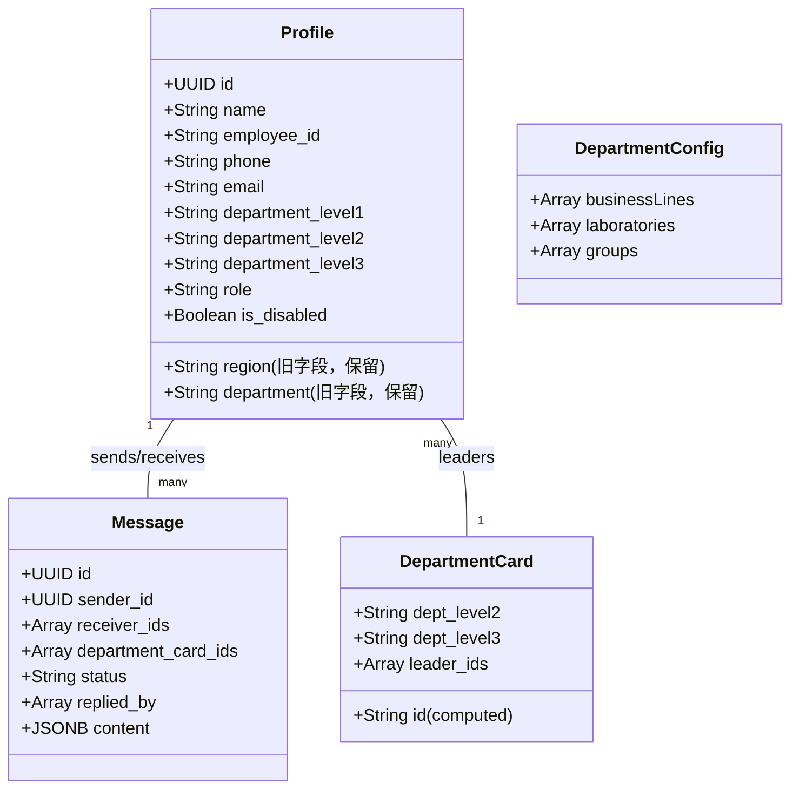
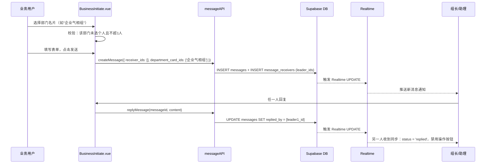
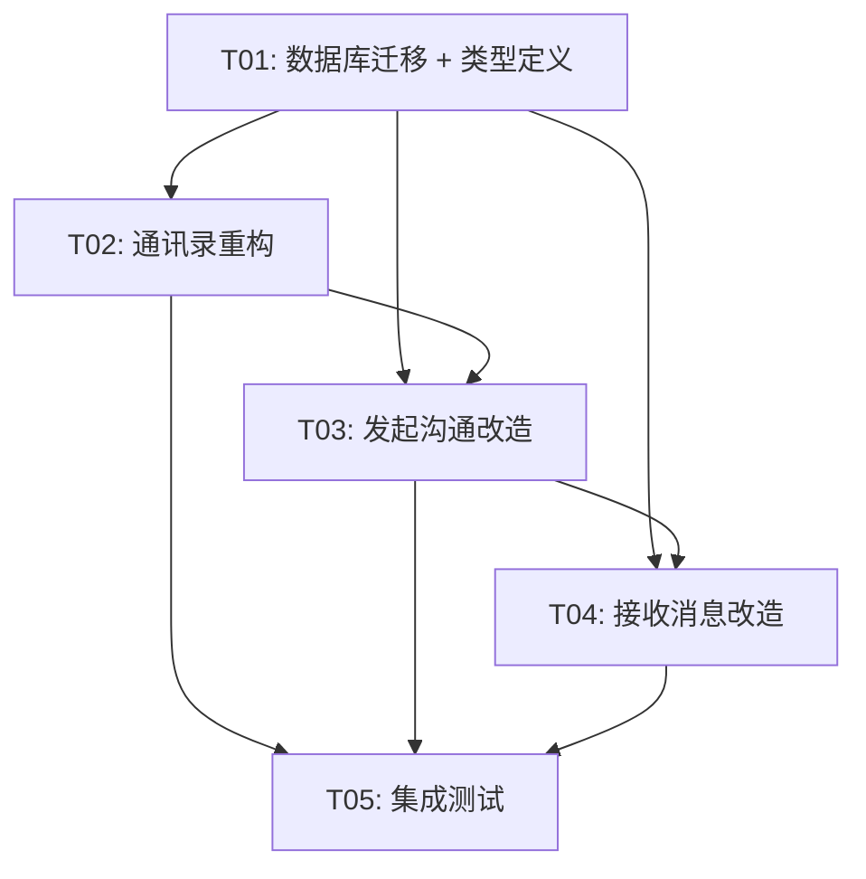

# QDCTI 增量需求系统架构设计

> **文档版本**: v1.0  
> **架构师**: 高见远 (Gao)  
> **日期**: 2025-06-10  
> **对应PRD**: 许清楚增量PRD（三级部门架构 + 部门名片 + 每部门限选一人）

---

## Part A: 系统架构设计

### 1. 实现方案

#### 1.1 核心难点分析

| 难点 | 挑战 | 解决方案 |
|------|------|----------|
| 三级部门联动 | 前端需要动态级联选择，且业务/实验室规则不同 | 使用 Elment Plus `el-cascader` 或三步 `el-select` 联动；配置数据前端硬编码 |
| 部门名片消息同步 | 两人操作需要状态同步，防止重复回复 | Supabase Realtime 订阅 `messages` 表 UPDATE 事件；前端响应 `replied_by` 变化 |
| 每部门限选一人 | 前端选择逻辑复杂，需要跨选项校验 | 维护 `selectedDeptMap` 映射，选择时校验并在选择器中禁用冲突选项 |
| 数据库迁移 | 旧字段 `department`/`region` 需要映射到新字段 | 写 Supabase 数据库迁移脚本；旧字段保留，新字段写入时同步回填旧字段 |

#### 1.2 框架与库选型

| 类别 | 选型 | 理由 |
|------|------|------|
| 前端框架 | Vue 3 + Vite（现有） | 保持技术栈一致 |
| UI组件库 | Element Plus（现有） | `el-cascader` 支持三级联动 |
| 状态管理 | 组件内 `ref` + `computed` | 增量需求逻辑局部性强，无需引入 Pinia/Vuex |
| 实时通信 | Supabase Realtime（现有） | 项目已用 Supabase，直接启用 Realtime 功能 |
| 拼音搜索 | pinyin-pro（现有） | 通讯录搜索已使用，复用 |

#### 1.3 架构模式

```
┌─────────────────────────────────────────────┐
│           Vue 3 Components (View)          │
│  Organization.vue / BusinessInitiate.vue   │
└──────────────┬──────────────────────────────┘
               │
┌──────────────▼──────────────────────────────┐
│         API Layer (src/api/index.js)       │
│  authAPI / profileAPI / messageAPI         │
└──────────────┬──────────────────────────────┘
               │
┌──────────────▼──────────────────────────────┐
│         Supabase (Backend as a Service)     │
│  Auth / Database / Realtime / Storage      │
└─────────────────────────────────────────────┘
```

---

### 2. 文件列表

```
frontend/
├── src/
│   ├── api/
│   │   └── index.js                  # 修改：新增 profileAPI、messageAPI 扩展部门名片方法
│   ├── types/
│   │   ├── user.ts                   # 修改：Profile 接口新增三级部门字段
│   │   └── message.ts                # 修改：MessageReceiver 新增 departmentCardId 字段
│   ├── utils/
│   │   ├── departmentConfig.js       # 新增：三级部门联动配置数据
│   │   └── supabase.js               # 修改：启用 Realtime 订阅
│   ├── pages/
│   │   ├── Organization.vue          # 修改：重构为三级部门展示，新增部门名片显示
│   │   ├── BusinessInitiate.vue     # 修改：新增部门名片选择器，限选逻辑
│   │   ├── LabInitiate.vue          # 修改：同上（实验室端发起沟通）
│   │   ├── BusinessReceive.vue      # 修改：部门名片消息显示"负责人"而非个人
│   │   └── LabReceive.vue           # 修改：同上
│   ├── components/
│   │   ├── DepartmentCascader.vue   # 新增：三级部门联动选择器（复用组件）
│   │   └── DepartmentCardSelector.vue # 新增：部门名片选择器组件
│   └── router/
│       └── index.js                  # 无需修改
├── supabase/
│   └── migrations/
│       └── 20250610000000_add_department_levels.sql  # 新增：数据库迁移脚本
└── docs/
    ├── system_design.md               # 本文件
    ├── class-diagram.mermaid          # 类图
    └── sequence-diagram.mermaid       # 时序图
```

---

### 3. 数据结构与接口



**关键类型定义（修改后）**：

```typescript
// types/user.ts 新增/修改
export interface Profile {
  id: string
  name: string
  employee_id: string
  phone: string
  email: string
  // 新增三级部门
  department_level1: '业务' | '实验室'
  department_level2: string   // 业务：产品线；实验室：实验室名称
  department_level3: string   // 业务：属地（手动填）；实验室：组名
  role: UserRole
  // 旧字段保留
  region?: string
  department?: string
}

// types/message.ts 新增
export interface DepartmentCardReceiver {
  department_card_id: string    // "企业气相组" 等唯一标识
  dept_level2: string
  dept_level3: string
  leader_ids: string[]         // 组长 + 组长助理 ID 列表
  replied_by: string[]         // 已回复的负责人ID
}

export interface Message {
  // ...existing fields...
  receiver_ids: string[]       // 个人接收人ID列表
  department_card_ids: string[] // 部门名片ID列表（新增）
}
```

---

### 4. 程序调用流程



**关键流程说明**：

1. **部门名片选择流程**：
   - 前端根据 `department_level1/2/3` 动态生成部门名片列表
   - 只有同时有"组长"和"组长助理"（或至少有组长）的 `dept_level3` 才显示部门名片
   - 选择部门名片后，消息 `receiver_ids` 填入 `leader_ids`，`department_card_ids` 填入部门名片ID

2. **消息同步流程**：
   - 消息表增加 `department_card_ids` 数组字段
   - 任一人回复后，后端函数（或前端直接UPDATE）将 `replied_by` 添加该人ID
   - 另一人通过 Supabase Realtime 订阅到 UPDATE 事件，刷新UI状态

3. **限选逻辑流程**：
   - 维护 `selectedMap: { [deptLevel3]: 'person' | 'card' | null }`
   - 选择个人时：检查 `selectedMap[deptLevel3]` 是否为 `'card'`，若是则禁止
   - 选择部门名片时：检查 `selectedMap[deptLevel3]` 是否为 `'person'`，若是则禁止

---

### 5. 待明确事项

1. **数据库迁移策略**：
   - 旧数据如何映射？建议：`department` → `department_level2`，`region` → `department_level3`，`department_level1` 根据角色判断（业务角色填"业务"，其他填"实验室"）
   - 是否需要写数据库函数自动迁移？还是一次性脚本？

2. **部门名片ID生成规则**：
   - 建议：`${department_level2}_${department_level3}`（如 `企业气相_气相组1`）
   - 需要保证唯一性

3. **Realtime 性能**：
   - 如果消息量大，Realtime 订阅是否需要只订阅 `receiver_ids` 包含当前用户ID的记录？
   - 建议：前端订阅时加 `.eq('receiver_ids', `userId`)` filter

4. **错误场景处理**：
   - 部门名片的负责人全部离职（`leader_ids` 所有用户 `is_disabled=true`）→ 发送时前端校验提示"该部门暂无负责人"
   - 一人回复后，另一人正在输入 → 回复提交时后端校验 `replied_by.length > 0` 则拒绝，返回"该消息已有回复"

---

## Part B: 任务分解

### 6. 依赖包列表

```
# 无新增依赖包，全部使用现有依赖
- vue@^3.3.13
- element-plus@^2.5.1
- @supabase/supabase-js@^2.107.0
- pinyin-pro@^3.28.1
```

---

### 7. 任务列表（按依赖顺序排列）

#### T01: 项目基础设施 + 数据库迁移

**任务ID**: T01  
**任务名称**: 数据库迁移 + 类型定义 + Supabase 配置  
**源文件**:
- `supabase/migrations/20250610000000_add_department_levels.sql`（新建）
- `src/types/user.ts`（修改）
- `src/types/message.ts`（修改）
- `src/utils/supabase.js`（修改）
- `src/utils/departmentConfig.js`（新建）

**依赖**: 无  
**优先级**: P0

**具体内容**：
1. 编写数据库迁移SQL：
   - `profiles` 表新增 `department_level1`, `department_level2`, `department_level3` 字段
   - `messages` 表新增 `department_card_ids` 字段（text[] 类型）
   - 写数据迁移脚本：旧字段映射到新字段
2. 修改 `types/user.ts`：Profile 接口新增三级部门字段
3. 修改 `types/message.ts`：Message 接口新增 `department_card_ids`
4. 新建 `departmentConfig.js`：硬编码三级部门联动配置
5. 修改 `supabase.js`：配置 Realtime 订阅（可选，后续任务用）

---

#### T02: 数据层 + 通讯录重构

**任务ID**: T02  
**任务名称**: 通讯录三级部门展示 + 部门名片显示  
**源文件**:
- `src/pages/Organization.vue`（修改）
- `src/api/index.js`（修改，新增 `profileAPI`）
- `src/components/DepartmentCascader.vue`（新建）

**依赖**: T01  
**优先级**: P0

**具体内容**：
1. 重构 `Organization.vue`：
   - 按三级部门层级展示通讯录（一级：业务/实验室；二级：产品线/实验室；三级：属地/组）
   - 只有同时有"组长"和"组长助理"的部门才显示"部门名片"标签
   - 点击部门名片标签，弹出该部门负责人列表（只读）
2. 新建 `DepartmentCascader.vue` 组件：
   - 接收 `v-model` 绑定三级部门值
   - 根据 `department_level1` 切换选项（业务/实验室规则不同）
3. 扩展 `api/index.js` 新增 `profileAPI`：
   - `updateProfile(userId, data)`：更新用户三级部门信息
   - `getDepartmentCards()`：获取所有可用部门名片列表

---

#### T03: 核心组件 - 发起沟通（业务端 + 实验室端）

**任务ID**: T03  
**任务名称**: 部门名片选择器 + 每部门限选一人逻辑  
**源文件**:
- `src/pages/BusinessInitiate.vue`（修改）
- `src/pages/LabInitiate.vue`（修改）
- `src/components/DepartmentCardSelector.vue`（新建）

**依赖**: T01, T02  
**优先级**: P1

**具体内容**：
1. 修改 `BusinessInitiate.vue` 和 `LabInitiate.vue`：
   - 接收人选择器改为"个人选择"+"部门名片选择"双模式
   - 新增"部门名片"选项卡：列出所有可用部门名片（调用 `profileAPI.getDepartmentCards()`）
   - 实现"每部门限选一人"逻辑：
     - 选择个人时，记录 `selectedMap[deptLevel3] = 'person'`
     - 选择部门名片时，记录 `selectedMap[deptLevel3] = 'card'`
     - 冲突时提示"该部门已选择个人/部门名片，请先取消"
   - 提交时，`department_card_ids` 填入选中的部门名片ID
2. 新建 `DepartmentCardSelector.vue` 组件：
   - 接收 `selectedDepartmentCards`（v-model）
   - 内部调用 `profileAPI.getDepartmentCards()` 获取列表
   - 渲染为可多选的卡片列表，带搜索功能

---

#### T04: 辅助组件 - 接收消息（业务端 + 实验室端）

**任务ID**: T04  
**任务名称**: 部门名片消息展示 + 状态同步  
**源文件**:
- `src/pages/BusinessReceive.vue`（修改）
- `src/pages/LabReceive.vue`（修改）
- `src/utils/supabase.js`（修改，启用 Realtime）

**依赖**: T01, T03  
**优先级**: P1

**具体内容**：
1. 修改 `BusinessReceive.vue` 和 `LabReceive.vue`：
   - 消息列表：如果消息有 `department_card_ids`，显示"企业气相组 负责人"而非具体姓名
   - 消息详情：显示"等待 张三/李四 回复"（两个负责人姓名）
   - 任一人回复后，消息状态变为"已回复"，两人都看到相同内容
2. 启用 Supabase Realtime：
   - 在 `BusinessReceive.vue` / `LabReceive.vue` 的 `onMounted` 中订阅 `messages` 表
   - 过滤条件：`receiver_ids` 包含当前用户ID 或 `department_card_ids` 对应的 `leader_ids` 包含当前用户ID
   - 收到 UPDATE 事件时，刷新消息列表/详情

---

#### T05: 路由 + 集成测试 + 最终调试

**任务ID**: T05  
**任务名称**: 端到端联调 + 边界场景处理 + 上线准备  
**源文件**:
- `src/pages/Admin.vue`（修改，管理员界面支持编辑三级部门）
- `src/router/index.js`（检查是否需要修改）
- 全量回归测试

**依赖**: T02, T03, T04  
**优先级**: P2

**具体内容**：
1. 修改 `Admin.vue`：
   - 管理员"编辑用户"弹窗中，将"部门"和"属地"输入框改为 `DepartmentCascader.vue` 三级联动选择器
   - 保存时同时写入新旧字段（保证兼容）
2. 边界场景处理：
   - 部门名片负责人全部离职 → 发送时前端校验 `leader_ids` 是否全部 `is_disabled=true`，提示"该部门暂无负责人"
   - 一人回复后另一人再回复 → 后端 `.rpc('reply_message')` 函数校验 `replied_by.length === 0`，否则返回错误
3. 编写数据库函数 `reply_message`：
   - 参数：`message_id`, `reply_content`, `replier_id`
   - 逻辑：检查 `replied_by` 是否为空，为空则更新，不为空则返回错误
4. 全量测试：
   - 测试三级部门联动选择
   - 测试部门名片发送和接收
   - 测试"每部门限选一人"逻辑
   - 测试 Realtime 同步

---

### 8. 共享知识（跨文件约定）

```
1. 数据库字段命名：
   - 新字段：snake_case（如 department_level1）
   - 旧字段保留，新代码优先使用新字段

2. 部门名片 ID 生成规则：
   - 格式：`${department_level2}_${department_level3}`
   - 示例：`企业气相_气相组1`
   - 保证唯一性（同一 dept_level3 只会有一种 dept_level2）

3. API 响应格式：
   - 统一使用 { code, data, message } 格式
   - code=0 表示成功，非0表示失败

4. 实时订阅规范：
   - 只订阅与当前用户相关的记录（filter: receiver_ids.cs.{userId}）
   - 组件卸载时必须 unsubscribe

5. 角色权限：
   - 只有 role in ['inspection_leader', 'inspection_leader_assistant'] 的用户才参与部门名片
   - role = 'inspection_engineer' 只能被选为个人，不参与部门名片

6. 日期格式：
   - 所有日期使用 ISO 8601 UTC 格式存储
   - 前端展示时转换为本地时区
```

---

### 9. 任务依赖图



---

## 附录：数据库迁移SQL示例

```sql
-- supabase/migrations/20250610000000_add_department_levels.sql

-- 1. 新增三级部门字段
ALTER TABLE profiles 
ADD COLUMN IF NOT EXISTS department_level1 TEXT CHECK (department_level1 IN ('业务', '实验室')),
ADD COLUMN IF NOT EXISTS department_level2 TEXT,
ADD COLUMN IF NOT EXISTS department_level3 TEXT;

-- 2. 数据迁移：旧字段映射到新字段
UPDATE profiles 
SET 
  department_level1 = CASE 
    WHEN role IN ('business', 'business_assistant') THEN '业务'
    ELSE '实验室'
  END,
  department_level2 = department,
  department_level3 = region
WHERE department_level1 IS NULL;

-- 3. messages 表新增部门名片字段
ALTER TABLE messages 
ADD COLUMN IF NOT EXISTS department_card_ids TEXT[];

-- 4. 创建索引
CREATE INDEX IF NOT EXISTS idx_profiles_dept_level1 ON profiles(department_level1);
CREATE INDEX IF NOT EXISTS idx_profiles_dept_level2 ON profiles(department_level2);
CREATE INDEX IF NOT EXISTS idx_profiles_dept_level3 ON profiles(department_level3);

-- 5. 启用 Realtime（在 Supabase Dashboard 操作）
-- 进入 Database -> Replication，勾选 messages 表的 UPDATE 事件
```
